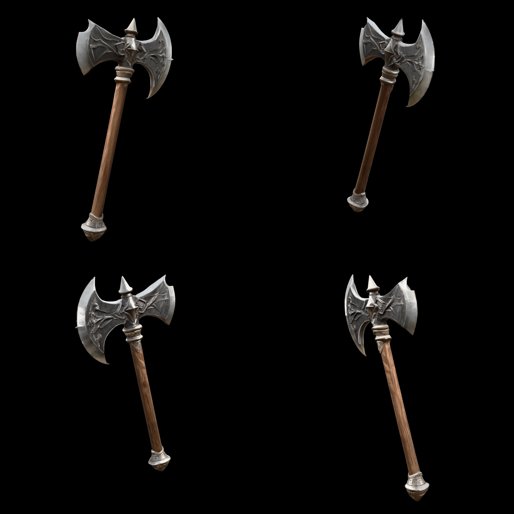
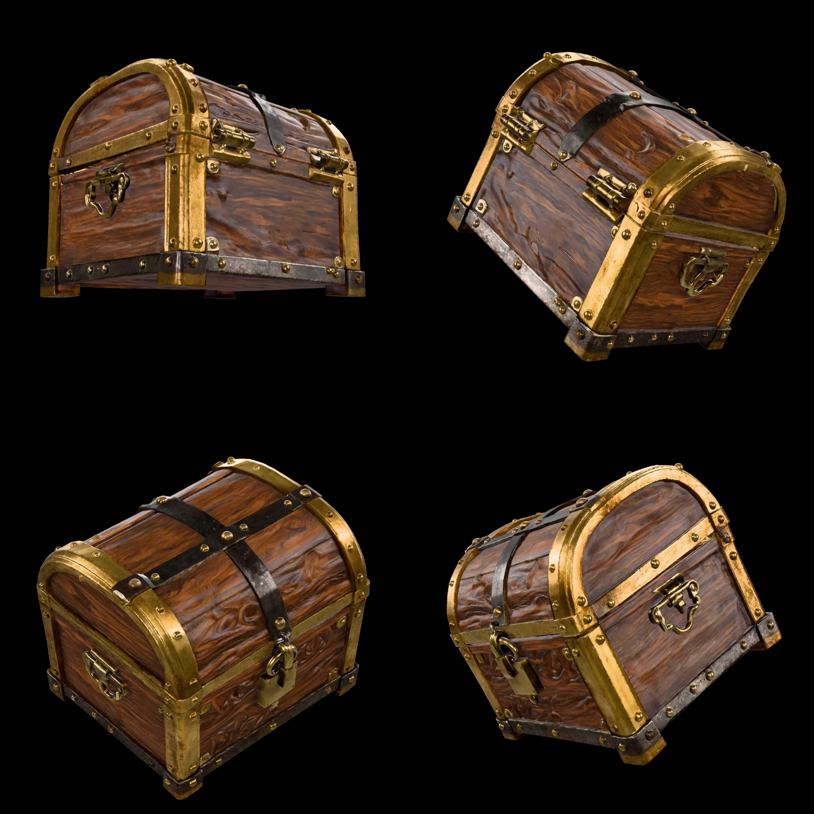
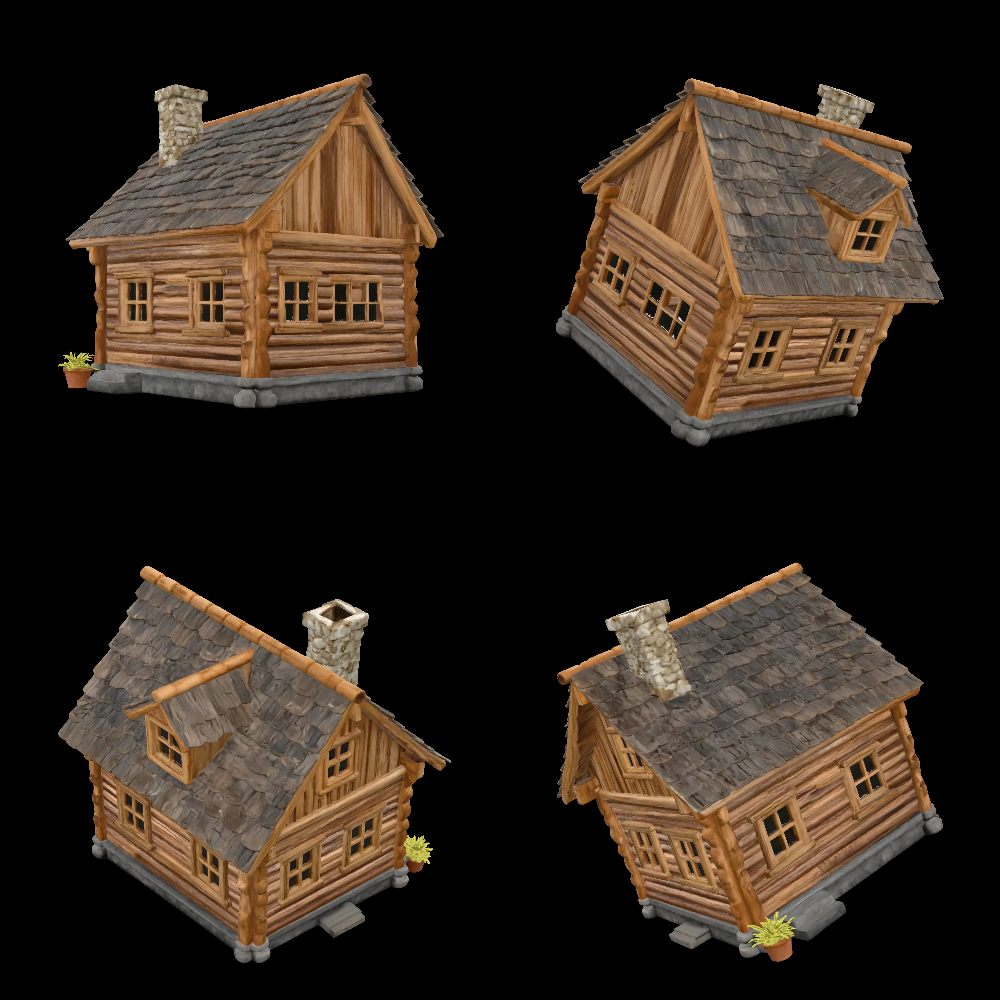
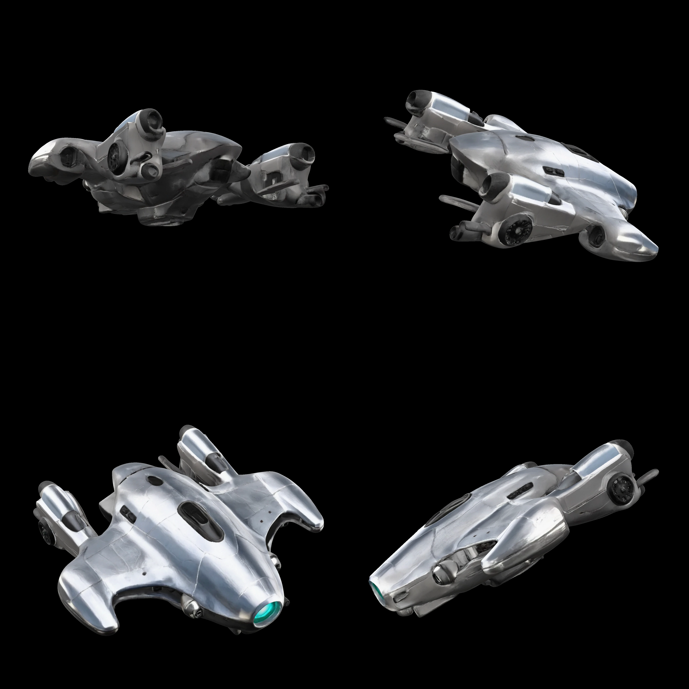
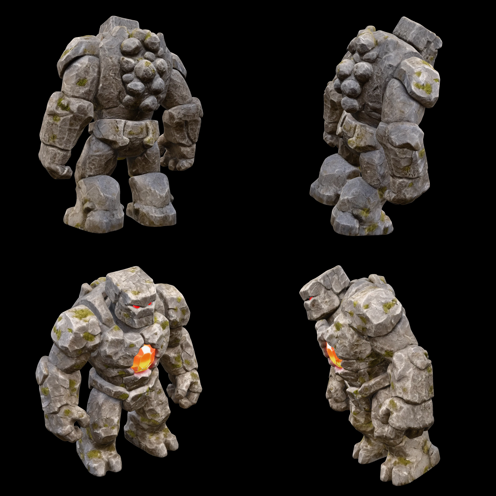
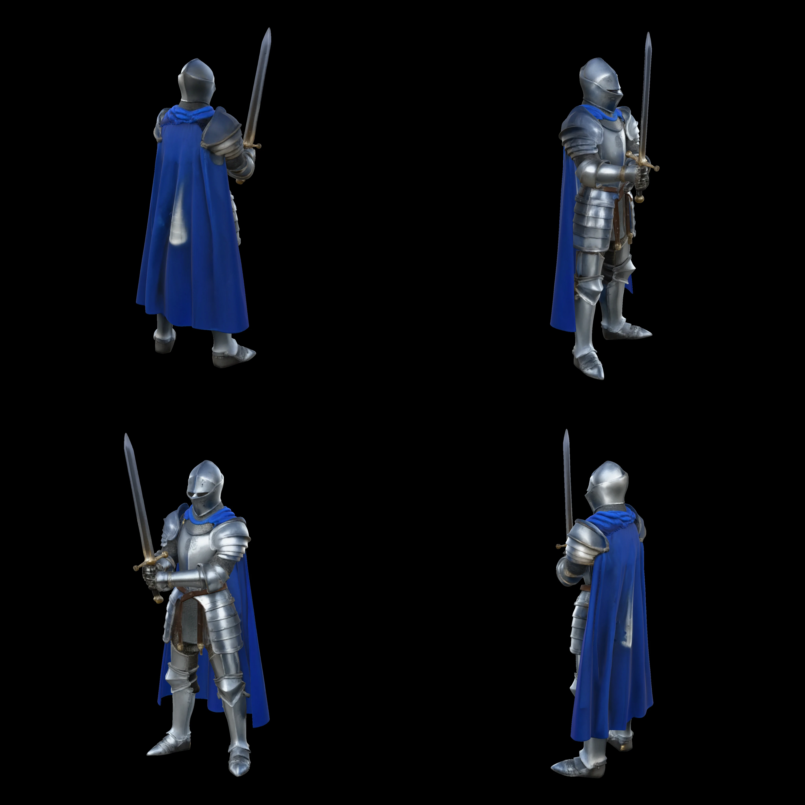
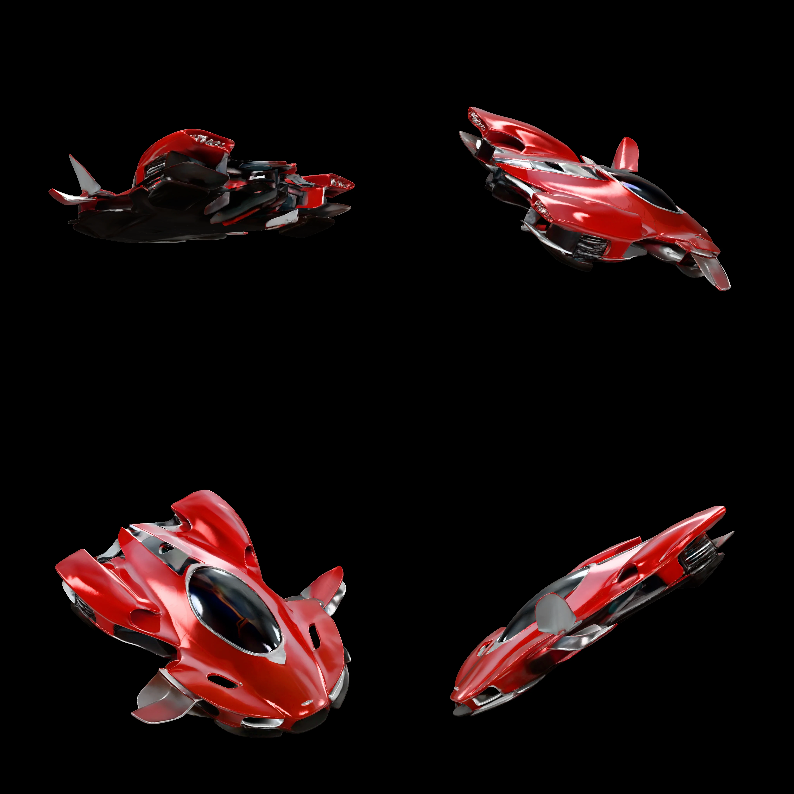
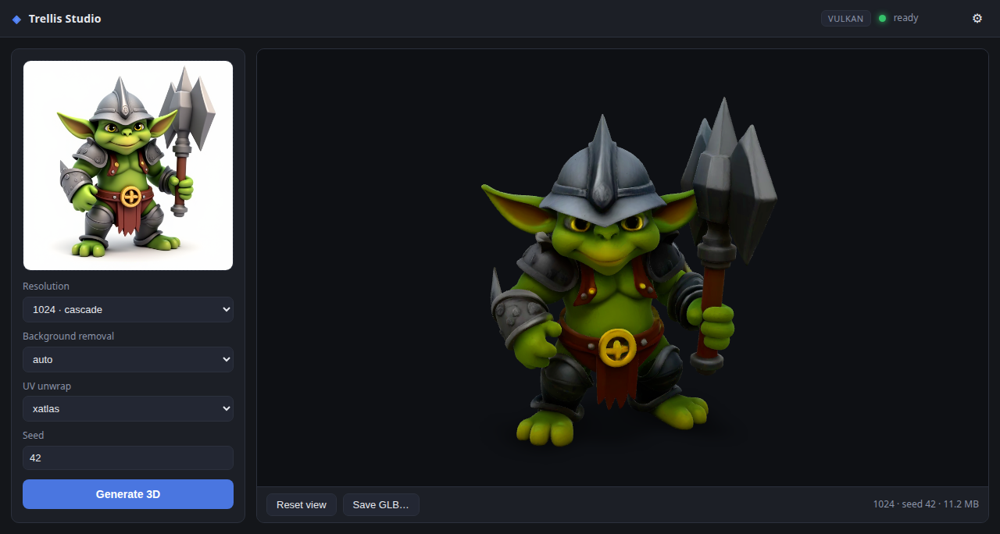

# trellis.cpp

> **This repository is `pixal3d.cpp`, a fork of
> [pwilkin/trellis.cpp](https://github.com/pwilkin/trellis.cpp)** (MIT, © 2026 Piotr Wilkin),
> extending it with the multiview, camera-aware [TencentARC Pixal3D](https://github.com/TencentARC/Pixal3D)
> backbone and a WebGPU/WASM browser target. The inherited pipeline described below is
> upstream's work; see [`NOTICE`](NOTICE) for full attribution and [`PIXAL3D.md`](PIXAL3D.md)
> for what this fork adds.

A standalone, **GGML-based C++** implementation of Microsoft's
[TRELLIS.2-4B](https://huggingface.co/microsoft/TRELLIS.2-4B) image-to-3D pipeline:
background removal, image conditioning, the three flow transformers, the VAE decoders,
mesh extraction and UV-textured GLB export — all in native C++/GGML with no Python at
runtime. Optionally driven end-to-end from a text prompt with
[stable-diffusion.cpp](https://github.com/leejet/stable-diffusion.cpp) producing the
input image.

It ports the reference implementation at
[microsoft/TRELLIS.2](https://github.com/microsoft/TRELLIS.2).

```
./build/trellis-cli assets/goblin.png out/goblin.glb      # image -> UV-textured GLB (atlas + PBR)
python tools/render_glb.py out/goblin.glb out/view.png    # quick multi-view render
```

Prebuilt binaries for Linux and Windows (Vulkan, ROCm, CUDA) are published on the
[releases page](../../releases). Serves as the `trellis` backend of
[Lemonade](https://github.com/lemonade-sdk/lemonade).

## Quick start

New here? **Trellis Studio** is a one-command install that auto-detects your GPU
runtime (CUDA / ROCm / Vulkan), downloads the server + weights, and gives you a
drag-an-image → 3D desktop app with an interactive preview and a saved gallery.

```bash
# Linux (x86-64)
curl -fsSL https://raw.githubusercontent.com/raven38/pixal3d.cpp/main/install/install.sh | bash
```
```powershell
# Windows (x64), in PowerShell
irm https://raw.githubusercontent.com/raven38/pixal3d.cpp/main/install/install.ps1 | iex
```

See [**Trellis Studio (desktop app)**](#trellis-studio-desktop-app) below for what it
does and how to use it, or [`docs/getting-started.md`](docs/getting-started.md) for the
full walkthrough and installer options.

## Showcase

Seven single-image→3D reconstructions produced end-to-end by pixal3d.cpp
(commit `ec464fe`, CUDA) on a single RTX 4090 with the published single-view
Pixal3D model set `pixal3d-sv-q8_0 v1` — BiRefNet matte → MoGe-2 FOV estimate →
`--views … --pixal3d-weights sv` (all res-1024 cascade, seed 42, Pixal3D's
default ~1M-face / 4096² atlas postprocess; the Draco-compressed GLBs, their
Z-Image-Turbo source images and the per-asset numbers live in
[`assets/showcase/`](assets/showcase/)):

<p>
<a href="assets/showcase/axe/axe_quad4k.webp"></a>
<a href="assets/showcase/chest/chest_quad4k.webp"></a>
<a href="assets/showcase/cottage/cottage_quad4k.webp"></a>
<a href="assets/showcase/drone/drone_quad4k.webp"></a>
<a href="assets/showcase/golem/golem_quad4k.webp"></a>
<a href="assets/showcase/knight/knight_quad4k.webp"></a>
<a href="assets/showcase/racer/racer_quad4k.webp"></a>
</p>

Each grid is a 4096×4096 four-view capture — `<model-viewer>` orbits 0° / 90° /
180° / 270° at 75° elevation, 2048² per view (in Pixal3D's reference frame the
view matching the source image is the 180° tile, bottom-left) — made with the
[`tools/mv_preview/render_quad.js`](tools/mv_preview/render_quad.js) recipe, a
headless Playwright driver around Google's `<model-viewer>`: one navigation per
view, wait for auto-framing to settle, capture via `toBlob`, and
[`stitch_quad.py`](tools/mv_preview/stitch_quad.py) assembles the final grid.

## Trellis Studio (desktop app)

**Trellis Studio** is the standalone desktop app (built with [Tauri](https://tauri.app))
for anyone who wants image→3D without touching the command line. The one-command
installer above auto-detects your GPU runtime, downloads the matching
`trellis-server` build plus the ~16.5 GB of weights, and installs the app; on launch
it starts and supervises the server for you, so the whole flow is drag-image →
click → rotate the result.

<p align="center">

</p>

**Using it:**

1. **Add an image** — drag-and-drop onto the drop zone, click to browse, or paste
   from the clipboard.
2. **Set options** (optional) — resolution (512 light / 1024 cascade / 1536 high),
   seed, background removal (auto / birefnet / threshold), and UV unwrap
   (xatlas / box). Defaults match the CLI.
3. **Generate 3D** — this takes a few minutes; a live stage line shows progress.
4. **Inspect** — rotate and zoom in the interactive preview (Google's three.js-based
   `<model-viewer>`); **Reset view** re-frames the camera and **Save GLB…** exports
   the model.
5. **Reuse** — every result is kept in a local **gallery** (IndexedDB): click a
   thumbnail to reload its model, input image, and settings — even after restarting
   the app.

The **Settings** panel (gear icon) points the app at a different models directory,
GPU index, or port; the models directory, backend, and server binary come from the
`config.json` the installer writes. Because the UI is a plain web bundle you can also
skip the app entirely and open it in a browser against a `trellis-server` you started
yourself — see [`docs/getting-started.md`](docs/getting-started.md) for that, the full
installer options, and troubleshooting. The app source lives in [`app/`](app/).

The sections below document the **CLI and HTTP server** directly, for advanced and
scripted use.

## Usage

The default is the **1024 cascade** (LR `flow_512` → upsample → HR `flow_1024` →
res-1024 decode, sharper geometry); `--res 512` selects the lighter res-512 path.
All behavior is driven by CLI flags — run `trellis-cli --help` for the full list.
The most useful ones:

| flag | effect |
|------|--------|
| `--res 512\|1024\|1536` | geometry resolution (512 = light path, no cascade) |
| `--bg-removal threshold\|birefnet` | default **auto**: pre-matted images keep their alpha, otherwise the BiRefNet matte (~13s on GPU). The plain white-bg keyer cuts specular highlights out of the alpha — the flow then generates holes there — so it is opt-in only |
| `--no-texture` | geometry only |
| `--decim GRID` | legacy cluster-grid decimation (default: quadric simplify to 300K faces @1024 / 150K @512; `0` = keep the full-res mesh) |
| `--atlas PX` | UV atlas size (default 2048 @1024 / 1024 @512) |
| `--box-uv` | voxel-native 6-way box projection instead of the default xatlas unwrap (O(faces), faster, looser packing) |
| `--seed N` | RNG seed |
| `--require-gpu` | fail instead of falling back to the (very slow, RAM-hungry) CPU path |
| `--profile` | after the second forward of every flow DiT, re-submit the same graph as role×block slices and as single nodes and print the breakdown (`[prof]` lines: by role / by block / by op / top nodes, plus the slice-sum vs whole-forward ratios). Timing only — the sampler still uses the whole-graph output. Adds roughly 4 forwards per flow |
| `--profile-cond` | print per-view / per-stage wall-clock laps of the conditioning (DINOv3 → NAF → projection, host and device paths) and of the sparse decoders / cascade upsample (`[cond-v]` lines). printf only — adds no compute, unlike `--profile`, so it can be used to time the conditioning without the flow side-passes heating the GPU first. The coarse per-stage `[cond]` laps are printed always, in the multiview pipeline (`--views`) only |

The postprocess matches the reference pipeline op for op (see
`docs/spec/27-reference-postprocess.md` / `28-divergence-matrix.md`): the raw
dual-grid mesh is welded and hole-filled, **remeshed with narrow-band UDF dual
contouring** into a single clean manifold, quadric-simplified to the face budget,
coarse-clustered with the reference's bottom-up normal-cone merge, unwrapped with
stock xatlas per cluster and packed at auto resolution (UVs normalized to fill the
full atlas), shaded per texel by trilinear sampling of the voxel PBR volume (with
BVH closest-point snap onto the original surface), gutter-filled with a Telea
inpaint port, and exported as a GLB with smooth normals and **lossy-WebP textures**
(`EXT_texture_webp`; PNG fallback when built with `-DTRELLIS_WEBP=OFF`). Output
quality is at parity with the reference CUDA postprocess on identical inputs.

`TRELLIS_DBG_*` environment variables toggle developer debug logging only; no
behavior-driving environment variables remain — use the flags above.

### trellis-server

`trellis-server` keeps the process resident (no Vulkan re-init per request) and exposes:

```
GET  /health     -> "ok"
POST /generate      multipart/form-data with an "image" file part; optional text
                    fields "seed", "resolution" (512/1024/1536), "bg_removal"
                    (threshold|birefnet). Returns model/gltf-binary.
```

Launch-time flags (including `--res`) set the per-request defaults; each request can
override them with its own fields.

### Pixal3D multiview mode

`trellis-cli --views DIR out.glb --models MODELS_DIR --res 1024|1536 [--num-views N] [--seed N]`
runs the Pixal3D camera-aware multiview cascade instead of single-image TRELLIS.2:

```
trellis-cli --views assets/mv_images/example --models pixal3d_models --seed 42 --res 1024 out.glb
```

`DIR` must contain `transforms.json` (Blender/NeRF convention: top-level `mesh_scale` and
`camera_angle_x` fallback, `frames[]` each with `file_path`, a 4×4 row-major `transform_matrix`
camera-to-world, and an optional per-frame `camera_angle_x`; frame 0 is the main/front view)
plus every frame's RGBA image, each with a **real alpha channel already baked in** — this mode
does no background matting, unlike the single-image path. `--num-views N` uses only the first
`N` frames. `--views` is mutually exclusive with the positional/`--image` input, and `--res 512`
is rejected: Pixal3D ships no res-512 texture flow, so the 1024/1536 cascade is mandatory.

**Without `transforms.json`**, a directory holding **exactly four** turntable views works too, as
long as you pass `--mesh-scale F` (a positive projection scale — no default is assumed, because a
wrong scale silently corrupts the reconstruction). This is still the **multiview** cascade with the
Pixal3D `*_mv.gguf` weights — it only removes the need to author camera JSON for the canonical
turntable layout; it is not a single-view mode:

```
trellis-cli --views ./views --mesh-scale 1.0 --models pixal3d_models --seed 42 out.glb
```

The four images are sorted by filename in natural order (`view2` before `view10`; the exact rule is
`natural_name_less` in `src/transforms_json.cpp`, mirrored by `natural_sort` in
`install/generate.sh` and cross-checked by `install/test_natural_order.sh`) and taken as
**front, right, back, left** — elevation 0, camera distance 3.119, FOV 20°, the same canonical rig
the browser app synthesizes (`web/real_e2e/calibration.js`). Anything else — three or five images,
a missing `--mesh-scale`, `--num-views` other than 4 — is rejected rather than guessed. A present
but malformed `transforms.json` is still an error; the rig is used only when the file is absent.
With `transforms.json` present, `--mesh-scale` overrides the value inside it.

`--pixal3d-weights sv|mv` picks the flow-weight family (default `mv`). The official Pixal3D
release has a single-view and a multiview checkpoint for each of the four flow stages; this repo
names the converted single-view files with `_sv.gguf` and the multiview files with `_mv.gguf`.
The same native loader/graph can read either family, while the five shared models are unchanged.
`sv` is validated at V=1 and `mv` at V=4; other view counts are allowed with an explicit warning.
This selector changes the checkpoint family only — with `--views` the input still uses the camera
contract (a one-frame `transforms.json`); `--sv-image` below synthesizes that frame for you.

**Single-view input without a `transforms.json` (0.10.0):** `--sv-image IMAGE.png` takes one
pre-matted RGBA image, crops it the way the reference preprocess does (alpha bbox, 1.1× square,
transparent padding) and synthesizes the front gauge camera (`mesh_scale` 1.0, FOV `--fov RAD`,
default 20°) in the shared C++ — no separate camera-estimation wrapper is needed. It forces
`--pixal3d-weights sv`, and the staged `input.png` + `transforms.json` are kept next to the output
so the run can be replayed as a normal `--views` input. `trellis-server` exposes the same path as
`POST /generate-sv`, and Trellis Studio has a **Pixal3D single view** mode.

```bash
./build/trellis-cli --sv-image belle_front.png --fov 0.3490658503988659 \
                    --models /path/to/pixal3d-sv-q8_0-v1 --seed 42 --res 1024 out.glb
```

**SV distribution status (0.10.0):** the SV set is a *second* model directory, never merged into
the MV one — `pixal3d-sv-q8_0 v1` and `pixal3d-f16 v1` / `pixal3d-q8_0 v1` share five file names
with different bytes. `install.sh --model-manifest-sv … --model-base-url-sv …` installs and
verifies it into `<dest>/models-sv` and writes `modelsDirSv` for Studio; `trellis-server
--models-sv DIR` serves it and reports both sets in `GET /capabilities`. To build the SV files
from a source checkout instead, start from an upstream TencentARC/Pixal3D snapshot that contains
the plain (non-`_mv`) safetensors/config files under `ckpts/`, then convert the four flows into a
directory that also contains the shared Pixal3D models:

```bash
export TRELLIS_MODELS=/path/to/TencentARC/Pixal3D
export TRELLIS_GGUF_OUT=/path/to/pixal3d_models
python3 tools/convert.py \
  pixal3d_ss_flow_sv \
  pixal3d_shape_flow_512_sv \
  pixal3d_shape_flow_1024_sv \
  pixal3d_tex_flow_1024_sv
```

That creates `pixal3d_ss_flow_sv.gguf`, `pixal3d_shape_flow_512_sv.gguf`,
`pixal3d_shape_flow_1024_sv.gguf`, and `pixal3d_tex_flow_1024_sv.gguf`. The existing
`dinov3.gguf`, `pixal3d_naf.gguf`, `ss_dec.gguf`, `shape_dec.gguf`, and `tex_dec.gguf` are shared
between SV and MV. A follow-up model-set release can add verified size/SHA manifests and installer
selection without changing the runtime selector introduced here.

For the currently published MV set, `--models DIR` needs `dinov3.gguf`, `pixal3d_naf.gguf`,
`pixal3d_ss_flow_mv.gguf`, `pixal3d_shape_flow_512_mv.gguf`,
`pixal3d_shape_flow_1024_mv.gguf`, `pixal3d_tex_flow_1024_mv.gguf`, `ss_dec.gguf`,
`shape_dec.gguf`, `tex_dec.gguf`. Per-view DINOv3 features are pixel-aligned-projected into a
shared 3D grid (`ProjGrid`) and averaged over views (`ProjectAttention`); the shape/texture stages
additionally fuse in NAF high-resolution image features. See `docs/spec/30-pixal3d-cond.md` for
the full conditioning spec. Face budget (1M), UV atlas (4096px) and remesh band (1) default to the
reference pipeline's own values in this mode (override with `--decim`/`--atlas`/`--band` as usual);
everything after SLAT sampling (decode/remesh/decimate/UV/bake/GLB export) is the same TRELLIS.2
postprocess code.

## Pipeline

```
text prompt
  │  stable-diffusion.cpp (Z-Image)              [external binary]
  ▼
RGB image
  │  BiRefNet / RMBG  (background removal)        [GGML]   → RGBA cutout
  ▼
DINOv3 ViT-L/16 feature extractor                [GGML]   → patch tokens [N,1024]
  │  (image conditioning, + null cond for CFG)
  ▼
① Sparse-Structure flow DiT (1.3B, dense 16³)    [GGML]
  │  → 8-ch 16³ latent → SS conv3d decoder → 64³ occupancy → active voxels
  ▼
② Shape-SLAT flow DiT (1.3B, sparse)             [GGML]   → 32-ch latent / active voxel
  │  → FlexiDualGrid shape decoder (sparse ConvNeXt) → dual grid → FlexiCubes mesh
  ▼
③ Texture-SLAT flow DiT (1.3B, sparse)           [GGML]   → 32-ch latent / active voxel
  │  → Sparse U-Net tex decoder (6-ch PBR per voxel)
  ▼
textured mesh
  │  weld → fill → narrow-band DC remesh → QEM edge-collapse decimate → cluster + xatlas →
  │  trilinear PBR bake (BVH snap) → Telea inpaint    [decimate: CPU / CUDA / HIP / Vulkan]
  ▼
UV-textured GLB (WebP PBR textures)
```

The decimation is a faithful port of the reference's CuMesh QEM edge-collapse simplifier
(Garland-Heckbert quadrics + a skinny-triangle shape metric + flip rejection + boundary
weighting), replacing an off-the-shelf simplifier that produced a fragmented, non-adaptive
mesh. The result matches the reference's adaptive triangulation — a single watertight
component with reference-level surface smoothness. It runs on the GPU (CUDA, ROCm/HIP, or a
Vulkan compute shader) behind one dispatch, with an automatic CPU fallback.

All three flow stages use a `FlowEulerGuidanceIntervalSampler` (rectified-flow Euler,
12 steps, classifier-free guidance with a guidance interval + rescale). Optional
512→1024 cascade for higher resolution.

The 1024 cascade runs on a 16 GB card thanks to **FlashAttention with padded K/V**
(`src/dit.cpp::sdpa`): the manual softmax needed a single ~18 GB score-matrix alloc at
the sparse-structure stage, and at the HR token count (≈53k) ggml's tiled FA NaN'd on
the unpadded last key-tile — zero-padding K/V to a 256 multiple + BF16 fixes both.
f16 compute is the default and matches torch (`--f32` forces f32; `--no-fa` restores
the plain-softmax path for A/B testing).

Every neural component is validated against PyTorch (the `trellis-test-*` binaries +
`tools/ref_*.py`): SS sampler matches torch to rel 4.3e-3 (exact voxel match), DiT
2.8e-3, DINOv3 1.8e-2, sparse conv 1e-3, BiRefNet 4e-4, C2S exact.

## Models

**Pre-built GGUFs:** [`ilintar/trellis2-gguf`](https://huggingface.co/ilintar/trellis2-gguf) —
download the full set and point `trellis-cli` / `trellis-server` (`--models DIR`) at that
folder. Or convert your own from the source checkpoints below (see `docs/spec/` and
`tools/` for the safetensors→GGUF conversion).

| role | source | notes |
|------|--------|-------|
| SS flow DiT | `microsoft/TRELLIS.2-4B` `ss_flow_img_dit_1_3B_64` | 1.3B, bf16 |
| Shape SLAT flow | `…/slat_flow_img2shape_dit_1_3B_{512,1024}` | 1.3B, bf16; `_1024` drives the cascade's HR pass |
| Tex SLAT flow | `…/slat_flow_imgshape2tex_dit_1_3B_{512,1024}` | 1.3B, bf16; `_1024` drives the cascade's HR pass |
| Shape decoder | `…/shape_dec_next_dc_f16c32` | FlexiDualGrid VAE |
| Tex decoder | `…/tex_dec_next_dc_f16c32` | Sparse U-Net VAE, 6-ch |
| SS decoder | `microsoft/TRELLIS-image-large` `ss_dec_conv3d_16l8` | reused from v1 |
| Image cond | `timm/vit_large_patch16_dinov3.lvd1689m` | ungated mirror of DINOv3 ViT-L (same weights) |
| BG removal | `ZhengPeng7/BiRefNet` | ungated BiRefNet (RMBG-2.0 substitute) |

The two helper models are HF-gated upstream; the ungated equivalents above avoid needing
a token.

## Performance

Measured end-to-end (image → GLB, res 1024, 12-step flows, includes model load;
`docs/spec/29-perf-profile.md` has the per-flow breakdown and methodology):

| input class | Strix Halo iGPU (Vulkan) | RTX 5060 Ti (CUDA) | reference Python, same GPU (cold) |
|---|---|---|---|
| light (goblin, 17k HR tokens) | 6:09 | **3:16** | 3:37 |
| heavy (turret, ~45k HR tokens) | 12:39 | **7:23** | 5:20 |

The postprocess (weld → remesh → decimate → unwrap → bake → WebP) uses the faithful
CuMesh QEM decimation described above. With a GPU backend it decimates a 5.4M→300k-face
mesh in ~5 s on ROCm (gfx1151) — ~18× the single-threaded CPU path — matching the
reference's on-GPU decimation; the CPU fallback stays available for GPU-less builds.
On Strix Halo, Vulkan is the fastest backend: ROCm requires
`GGML_CUDA_DISABLE_GRAPHS=1` (ggml's HIP graph capture stalls on these graphs)
and still trails Vulkan by 10–40 %.

**Apple Silicon (Metal):** verified end-to-end on an Apple M5 (24 GB unified):
res-512 image → textured GLB in **9:21** with a **5.6 GB** peak RSS, all
neural stages on Metal (2.4M decoded voxels, 4.8M-face raw mesh). bfloat16 and
f16 tensor APIs are available from M2 on; on M1 use `TRELLIS_FA_FAST=1`
(f16 K/V) since the default FlashAttention path casts K/V to bf16.

## Tools

| tool | purpose |
|------|---------|
| `post-replay <dump.bin> <out.glb>` | re-run the whole postprocess from a `TRELLIS_DUMP_POST` dump in seconds (flags: `--no-remesh`, `--band`, `--no-snap`, `--box-uv`, `--faces`, `--atlas`, …) |
| `tools/glb_metrics.py` | CPU geometry/UV/material metrics (components, boundary edges, winding, texel density, doubleSided/WebP flags) for ours-vs-reference GLB comparison |
| `tools/render_glb.py` / `render_glb_fast.py` | quick multi-view flat renders |
| `tools/mv_preview/` | PBR-correct GLB previews via the `<model-viewer>` web component (see its README) |

## Building

GGML is vendored in `thirdparty/ggml`. Pick a backend:

```
cmake -B build -G Ninja -DCMAKE_BUILD_TYPE=Release -DGGML_VULKAN=ON   # Vulkan
cmake -B build -G Ninja -DCMAKE_BUILD_TYPE=Release -DGGML_CUDA=ON    # CUDA
cmake -B build -G Ninja -DCMAKE_BUILD_TYPE=Release -DGGML_HIP=ON     # ROCm
cmake -B build -G Ninja -DCMAKE_BUILD_TYPE=Release                   # macOS: Metal (auto)
cmake --build build -j
```

On **macOS/Apple Silicon** no backend flag is needed — ggml's Metal backend
defaults ON for Apple builds and the generic device selection picks the GPU.
The two custom kernels (BiRefNet deformable conv, QEM decimation) run their
CPU fallbacks there.

See `.github/workflows/release.yml` for the exact flags the release binaries use
(GPU target lists, `-DGGML_OPENMP=OFF` on Windows). Releases also include a
`cuda12` variant built with CUDA 12.9 for Pascal/Volta GPUs (compute capability
6.0/6.1/7.0); the standalone installers select it automatically for devices such
as the Tesla P100, and `install.sh` also selects it on **WSL2** when the user-mode
CUDA driver reported by `nvidia-smi` is older than the R590 branch the CUDA 13.1
runtime corresponds to (#35).

## Layout

```
src/            C++ implementation (models, ops, pipeline, drivers)
src/test_*.cpp  parity / unit tests vs reference tensors (built as the trellis-test-* binaries)
include/        public headers
tools/          python conversion scripts (safetensors → GGUF) + reference-dump checks, via the uv venv
docs/spec/      reverse-engineered per-component architecture spec
thirdparty/     vendored ggml (gitignored), plus stb + xatlas
```
