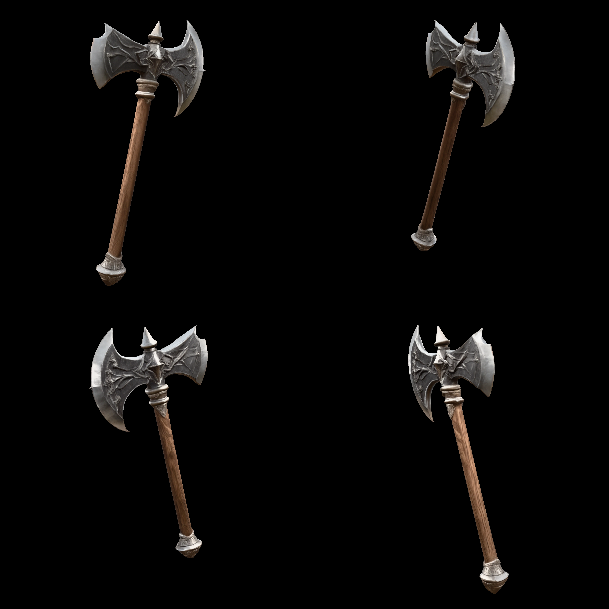
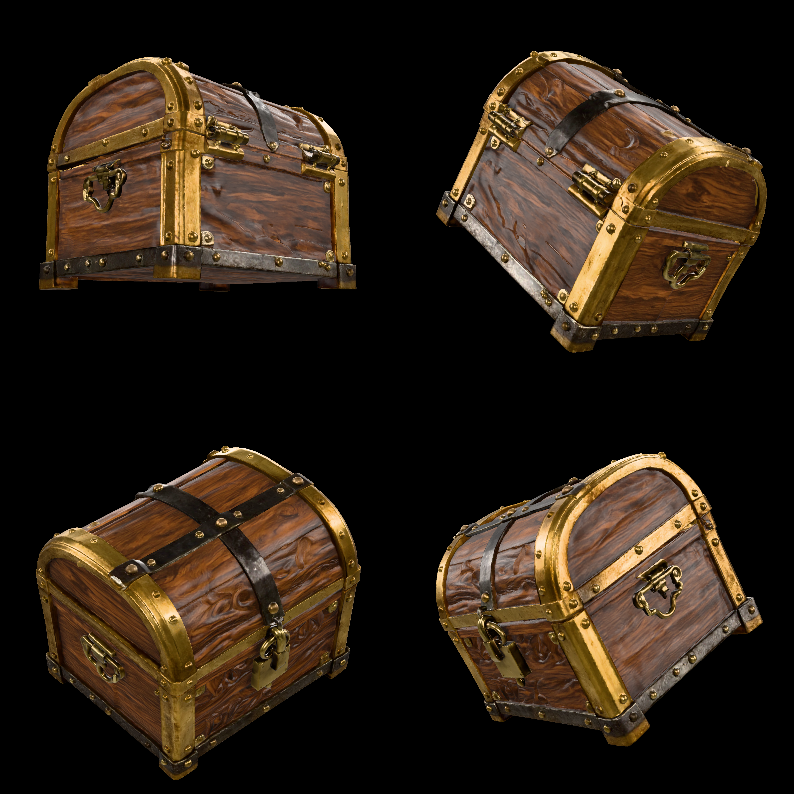
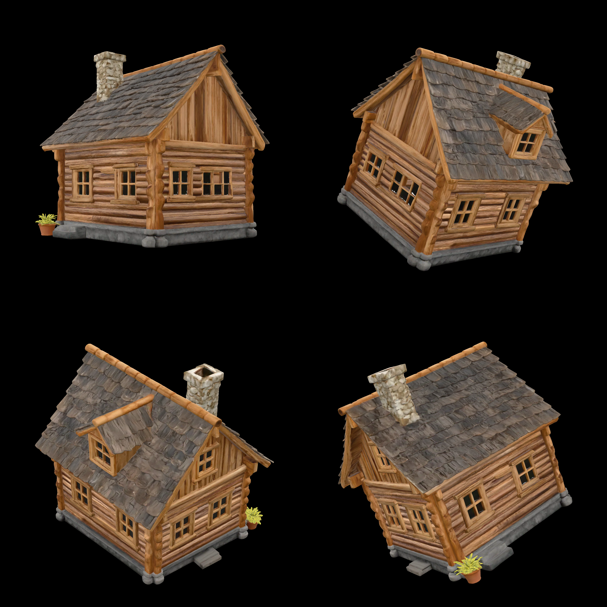
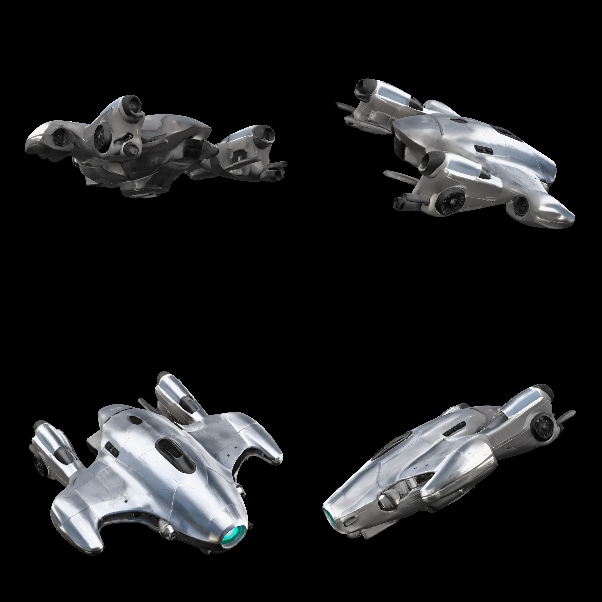
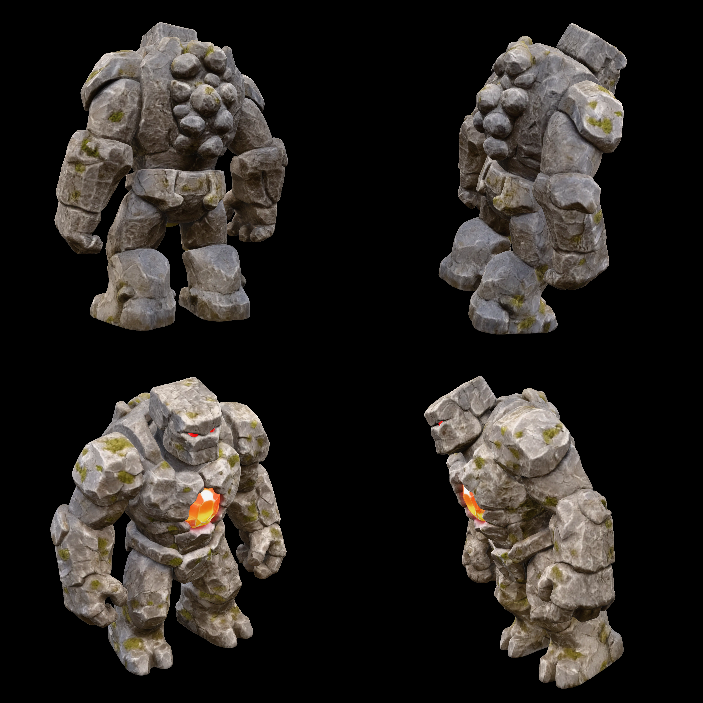
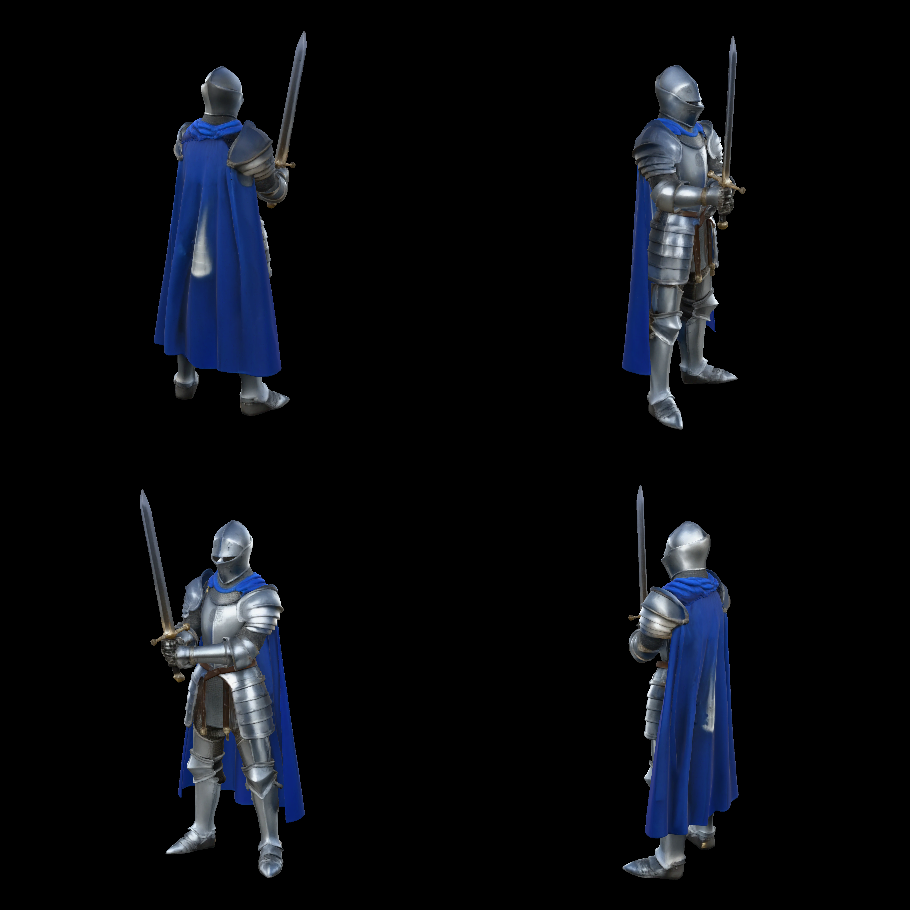
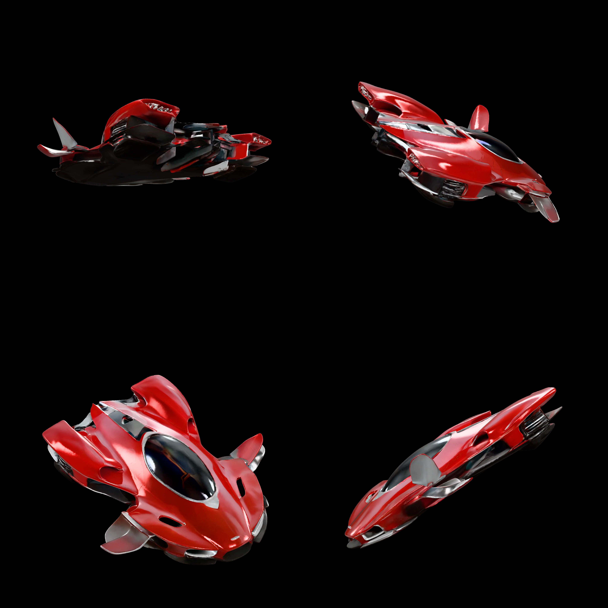

# pixal3d.cpp showcase gallery

Seven image→3D reconstructions produced end-to-end by **pixal3d.cpp** (this
repository's C++/GGML port of TencentARC Pixal3D on the TRELLIS.2 backbone),
running on a single RTX 4090 (CUDA, Linux/WSL2 build of commit `ec464fe`, the
first commit after `v0.9.0-web-alpha`) with the published **single-view** model
set `pixal3d-sv-q8_0 v1` (`models/pixal3d-sv-q8_0-v1/pixal3d-models.json`).
Each asset went through the full single-image pipeline: BiRefNet matte
(`trellis-cli --bg-only`) → MoGe-2 horizontal-FOV estimate + canonical front
camera (`tools/run_pixal3d_estimated.py`, `mesh_scale 1.0`) → DINOv3 + NAF
conditioning → ProjectAttention-conditioned sparse-structure flow → shape SLAT
flows (res-512 → res-1024 cascade) → FlexiDualGrid decode → texture SLAT flow +
PBR decode → hole fill → narrow-band DC remesh → QEM edge-collapse decimation →
xatlas UV unwrap + PBR bake → WebP-textured GLB.

The source images are the same clean isometric studio renders (Z-Image-Turbo)
used by the earlier trellis.cpp (TRELLIS.2-4B, v0.4.3, Radeon 8060S) gallery;
those results were replaced by the Pixal3D outputs below on 2026-09-19.

All assets: res-1024 cascade, **seed 42** (embedded in each GLB's asset extras
together with the commit, backend and build/generation timestamps), Pixal3D's
default 1,000,000-face quadric target and 4096² texture atlas (the
`inference_mv.py` defaults — the `--views` path does not use TRELLIS.2's
300K / 2048² defaults).

## Assets

Each `<name>/` directory contains:

- `<name>.png` — the source image fed to the pipeline (RGB, no alpha)
- `<name>.glb` — the textured PBR mesh output. Regenerate with

  ```sh
  ./build/trellis-cli <name>.png cut.glb --bg-only --models <sv-models>      # -> cut_cutout.png
  python tools/run_pixal3d_estimated.py --image cut_cutout.png --models <sv-models> \
      --trellis-cli ./build/trellis-cli --seed 42 --res 1024 -o <name>.glb
  ```

  where `<sv-models>` holds the `pixal3d-sv-q8_0 v1` set plus `birefnet.gguf`
  (the wrapper stages the crop, runs MoGe-2, and calls
  `trellis-cli --views … --pixal3d-weights sv`).
- `<name>_quad4k.png` — a 4096×4096 four-view render (2048×2048 per view, 75°
  elevation, `<model-viewer>` orbits 0° / 90° / 180° / 270°) for detail
  inspection. In Pixal3D's reference frame the input camera looks at the −Z
  side of the model, so the view that matches the source image is the third
  tile (180°, bottom-left).

| Asset | Description | MoGe-2 FOV | Faces | GLB | Wall |
|-------|-------------|-----------:|------:|----:|-----:|
| **axe** | Ornate fantasy battle-axe, engraved steel head on a wooden haft | 31.2° | 965K | 38.3 MB | 124 s |
| **chest** | Treasure chest — wood panels, brass corner fittings, steel bands, padlock | 18.4° | 993K | 40.4 MB | 294 s |
| **cottage** | Log cabin with shingled roof, dormer, stone chimney and potted plants | 18.6° | 913K | 43.0 MB | 397 s |
| **drone** | Sleek chrome hover-drone / concept car | 26.6° | 967K | 37.3 MB | 217 s |
| **golem** | Stone golem, cracked-rock surface with moss and a glowing core | 27.6° | 947K | 34.5 MB | 198 s |
| **knight** | Plate-armoured knight with blue cape and sword | 41.7° | 941K | 36.9 MB | 153 s |
| **racer** | Red futuristic hover-racer | 45.1° | 998K | 40.7 MB | 230 s |

"Wall" is `trellis-cli`'s own `done in` time for the flow + decode + postprocess
(the BiRefNet matte adds ~13 s and MoGe-2 ~30 s per asset). Peak GPU memory
over the batch was 15.6 GB (`nvidia-smi`, including 1.65 GB of unrelated
resident processes).

### Gallery









---

*Rendered with `<model-viewer>` (the `tools/mv_preview/render_quad.js` recipe:
one headless Playwright navigation per view, `toBlob` capture, stitched by
`stitch_quad.py`); camera at 75° elevation, orbiting 0° → 90° → 180° → 270°.*
