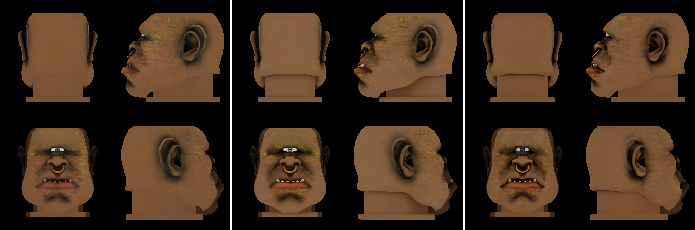

# Metal FlashAttention の K/V 型（F16 / BF16 / F32）A/B と数値ゲート — 2026-09-20（issue #30）

設計: `docs/design/2026-09-20-metal-fa-f16-kv.md`（codex レビュー `docs/reviews/2026-09-20_metal-fa-f16-kv_review.md`）。
環境: macOS 26.5 / MacBook Pro M4 Max（Mac16,6、64 GB、AC 給電）/ Metal（`MTL0`、has_bfloat = true、
tensor API 無効 = pre-M5 の legacy `mul_mm` 経路、native 既定の attention chunk 1 GiB）/
重み `pixal3d-q8_0 v1`（MV、`~/nfs/weights/pixal3d/gguf-q8_0`）/ ビルド `build-metal-fa/`（commit 806895d 相当、Release）。
**GPU は同時刻に他セッション（#29 / #33）と共有**。各 run の前後で他の `trellis-*` プロセスを記録し、重なった run は
「汚染」として集計から外した（生ログに残してある）。

## 0. 結論

- **速度（issue #30 の主目的）: f16 K/V は M4 Max で速くならない。** Shape-1024 は paired ratio 0.974 [0.932, 1.018]
  （差なし）、Texture は 0.955 [0.922, 0.989]（f16 が 4.5% 遅い）、f32 K/V は 2 倍遅い（clean block 5/5、§5）。
  **既定 `--fa-kv auto` = bf16 は変えない。**
- **数値: Metal では現行既定の bf16 K/V が、測った 3 つの尺度すべてで最も精度が低い。** op 単体の float64 参照
  （合成入力、§3）で bf16 7.5e-3 / f16 3.7e-4 / no-fa 4.5e-4。実 conditioning の tex flow（§7、初期 noise 5 seed、
  paired、再実行 bit-exact）で **no-fa 経路（materialized softmax、half オペランド）からの距離**は bf16 3.0–3.8%、
  f16 0.02%（比 0.006、片側 95% CI 上限 0.008）。E2E の SS latent（§6.3）でも bf16 4.4e-2 vs f16 6.4e-3（比 0.15）。
  **これらは真値（float64）に対する精度ではなく no-fa への距離**で、f16 と no-fa が半精度オペランドの丸めを共有して
  いる分は分解できていない（真値に対する差が言えるのは §3 の op 単体 ×20 まで）。機構は Metal カーネルの型指定
  （bf16: q が bfloat + 出力累積 half、§1）で、CUDA の「bf16 が安全」とは逆。
- **範囲: Q/K の F16 overflow は静的に排除、V は cyclops 1 入力で観測なし。** Q/K は RMSNorm×gamma の上界（≤ 206、
  §2）で入力非依存、V は cyclops で headroom ≥ 12646×（§4、**1 入力のみ**）。NaN/Inf は全経路 0。
- **副産物 2 つ**: (i) Metal の `--no-fa` は F32 参照ではない（`kernel_mul_mm_f32_f32` が half オペランド、§3）。
  (ii) `trellis_cli.cpp` の noise は行番号で voxel に結び付くので、SS の voxel 集合が 1 個違うと下流は別サンプルに
  なる（§6.2）。E2E レベルの要素比較は SS latent までしか成立しない。
- **判断はユーザーへ**: 精度目的で Metal の既定を f16 にするか（速度中立〜Texture 約 3–5% 減、op 単体で float64 に
  20 倍近い、tex fixture で no-fa に 160 倍近い、V の範囲は 1 入力のみ確認、Q2 は tex flow のみ）。変えるなら別
  issue/PR で、2 入力目の範囲計測・shape HR fixture の paired 試験・holdout E2E を付ける（精度理由の既定変更にも
  holdout は必要）。WebGPU 経路（BF16 FA が無く f16 必須）は別 backend・別カーネルなので本結果は転用できず、
  示唆（Q/K の静的上界は backend 非依存）に留まる。

## 1. Metal カーネルの数値仕様（ソース確認、設計 §背景の再掲）

| K/V 型 | q の格納型 | K/V | QK / softmax | 出力累積 O | `set_prec(F32)` |
|---|---|---|---|---|---|
| bf16（現行既定） | bfloat（仮数 7 bit） | bfloat | float | **half** | 無視される |
| f16 | half（仮数 10 bit） | half | float | **float** | 無視される |
| f32 | half | float | float | float | 無視される |

`thirdparty/ggml/src/ggml-metal/ggml-metal.metal` L6556–6580（`FA_TYPES*`）、O 行列 `so` は L5939（threadgroup、KV ループ
L6028 をまたいで保持、L6291 で `*= ms` 再スケール）。Metal backend は `ggml_flash_attn_ext_get_prec` を読まない
（`grep -rn prec ggml-metal/` にヒット無し）。head_dim = 128、pipeline は `kernel_flash_attn_ext_<type>_dk128_dv128`。

## 2. R1: Q / K の静的 F16 上界（`tools/fa_gamma_bound.py`、q8_0 MV v1）

| flow | max\|gamma\|（self q / self k / cross q / cross k） | 上界 sqrt(128)·max\|gamma\| | F16 headroom |
|---|---|---:|---:|
| SS | 3.67 / 8.47 / 1.79 / 1.80 | 95.8 | 684× |
| Shape-512 | 17.17 / 18.20 / 2.60 / 2.69 | 205.9 | 318× |
| Shape-1024 | 17.16 / 18.20 / 2.61 / 2.70 | 205.9 | 318× |
| Texture | 5.31 / 5.29 / 1.39 / 1.39 | 60.1 | 1091× |

Q / K は `rms_gamma`（head_dim 単位の RMSNorm × gamma）→ RoPE（ノルム保存）なので、要素は `sqrt(128)·max|gamma|` を
超えられない。V には RMSNorm が無いので動的計測（§4）でしか裏付けられない。

## 3. O: attention op 単体の float64 参照との比較（`trellis-test-fa-oracle`）

`dit_sdpa`（実際の `sdpa` 経路）1 回を、合成入力 q,k ~ N(0, sq²)・v ~ N(0, 4²)、hd=128・nh=12 で走らせ、64 query を
サンプルして float64 のホスト参照と比べる。rel_rms = rms(out − ref) / rms(ref)。

| backend | N | regime | exact（`--no-fa`） | FA bf16 K/V | FA f16 K/V | FA f32 K/V |
|---|---:|---|---:|---:|---:|---:|
| CPU | 64 | flat sq=1 | 1.4e-7 | 2.8e-3 | 2.9e-4 | 3.5e-7 |
| Metal M4 Max | 17612 | flat sq=1 | **4.5e-4** | **7.5e-3**（max\|d\| 4.3e-3） | **3.7e-4**（max\|d\| 1.1e-4） | 2.1e-4 |
| Metal M4 Max | 17612 | peaked sq=3 | 1.1e-3 | 8.6e-3（max\|d\| 0.35） | 1.1e-3（max\|d\| 3.7e-2） | 7.1e-4 |

nonfinite は全構成 0。max|d| は **等間隔にサンプルした 64 query 上の最大**（全 17612 query の 0.36%）で、
attention entropy との対応は測っていない。CPU の exact 経路は真の F32 参照（1.4e-7）だが、**この実行では Metal の
exact 経路は F32 参照ではない**: `--no-fa` は QK と PV を `ggml_mul_mat` で組み、N=17612・1 GiB chunk では
`ne11` = 1270（最終 chunk 1102）> 8、入力は `ggml_cont` 済み、M4 Max は simdgroup_mm あり・tensor API 無効なので
`ggml-metal-ops.cpp` の dispatch は legacy `kernel_mul_mm_f32_f32`（`ggml-metal.metal` L10205）を選ぶ（log にも
その compile が出る）。このカーネルは両オペランドを threadgroup メモリに `half` で置いて `simdgroup_half8x8` で
積和する（累積は float）ので、`--no-fa` は Q/K/V に加えて **softmax 出力 P も half に丸めた** materialized-softmax
経路になり、FA f16 K/V と同じ 4e-4 級に落ちる（テストの `FA_ORACLE_EXACT_REF` はこれを検出して NOT-F32 を出す。
`FA_ORACLE_RESULT` 自体は OK）。`ne11 ≤ 8`、転置入力、simdgroup 非対応、tensor API 有効（M5 以降）では別経路に
なるので、この記述は本環境に限る。

読み取り:
- Metal では **bf16 K/V（現行既定）が float64 から最も遠い**（flat 7.5e-3、peaked 8.6e-3）。f16 K/V はその **1/20〜1/8**
  で、Metal の no-fa 経路や f32 K/V と同じ桁。§1 のカーネル仕様（bf16: q が bfloat + O 累積 half）と整合するが、
  q の型と O 累積型のどちらが主因かは独立に A/B していない（分解は未実施）。
- peaked では bf16 の sampled max|d| が 0.35（ref の rms は ~4）。「softmax が尖った query で外す」は候補の説明で、
  query ごとの entropy は取っていない。
- f32 K/V は f16 K/V と同桁（q が half のままなので、K/V を float にしても q 側の量子化で頭打ち）。

## 4. R: 実入力での FA operand の範囲（`TRELLIS_DBG_FA_RANGE=qkv`、cyclops 4 view、seed 1、bf16 既定で 1 本）

cast 前の F32 テンソルの max|x|（全 forward・全 block の最大）と F16 headroom = 65504 / max。`sub` は非ゼロ要素のうち
F16 正規化数下限 6.1e-5 未満の割合（最大）、`tiny` は 6e-8 未満（f16 で 0 に落ちる）の割合。nonfinite は全て 0。

| flow | N | fwd | self Q | self K | self V/256 | cross Q | cross K | cross V/256 | 最小 headroom |
|---|---:|---:|---:|---:|---:|---:|---:|---:|---:|
| SS | 4096 | 20 | 16.6 | 56.9 | 2.67 | 12.4 | 18.9 | 0.27 | **1152×**（self K） |
| Shape-512 | 4438 | 20 | 136 | 177 | 4.32 | 17.5 | 29.0 | 0.50 | **370×**（self K） |
| Shape-1024 | 17614 | 20 | 148 | 182 | 5.18 | 17.5 | 29.4 | 0.51 | **360×**（self K） |
| Texture | 17614 | 12 | 39.9 | 40.2 | 1.56 | 11.5 | 6.56 | 0.16 | **1629×**（self K） |

- self K の実測最大 182（Shape-1024）は静的上界 205.9（§2）の内側で、上界が効いていることも確認できる。
- `tiny`（f16 で 0 に落ちる非ゼロ要素）の最大割合は self Q/K で 5e-5 以下、V で 4e-6 以下、cross V で 9e-4（uncond 側の
  cond=0 forward で V ≈ bias になる forward が含まれる。cond=0 では全 key の V が同一なので softmax 重みに依らず出力は
  同じで、精度に影響しない）。
- **ゲート 1（NaN/Inf 0）・2（headroom ≥ 8×）は通過**。probe 込みの HR flow は 24 s/fwd（通常 14 s）で、12 GiB の
  output 固定は M4 Max 64 GB の予算内に収まった（`check_device_budget` は投げなかった）。
- 2 入力目（belle、単一画像 + MV 重み V=1）は未実施（速度ゲート不通過により優先度を下げた。§8）。

## 5. S: 速度 A/B（`trellis-test-dit-bench`、乱数入力、3 fwd の #1–#2 平均、counterbalanced block）

1 run = 冷却（Shape-512 60 s / HR 150 s。HR は 90 s だと直前の他セッション E2E の熱が抜けず run 内で 11.9→17.9 s と
ドリフトしたので延長）→ 3 forward（#0 は pipeline compile の warm-up）。block 内の腕の順序は ABC / CBA / BCA / ACB / CAB / BAC。
run の前後どちらかに他セッションの `trellis-*` プロセスが居た run は「汚染」として block ごと除外。
pipeline 名はログで確認: bf16 = `kernel_flash_attn_ext_bf16_dk128_dv128`、f16 = `..._f16_dk128_dv128`、f32 = `..._f32_dk128_dv128`。

| flow | N | clean block | bf16 | f16 | f32 | paired `bf16/f16` 幾何平均 [95% CI] | paired `bf16/f32` |
|---|---:|---:|---:|---:|---:|---|---|
| Shape-1024 | 17612 | 5 / 5 | 14.25 s | 14.62 s | 27.97 s | **0.974 [0.932, 1.018]**（差なし、f16 がやや遅い傾向） | 0.510 [0.485, 0.537] |
| Texture | 17612 | 5 / 5 | 13.96 s | 14.63 s | 27.36 s | **0.955 [0.922, 0.989]**（f16 が約 3–5% 遅い方向、n=5 の CI は脆い） | 0.511 [0.486, 0.537] |
| Shape-512 | 4438 | 1 / 6（他 5 block は汚染） | 1.66 s | 1.72 s | 1.90 s | 0.965（n=1） | 0.874（n=1） |

block 別（HR、秒）:

| flow | block | 順序 | bf16 | f16 | f32 | bf16/f16 |
|---|---:|---|---:|---:|---:|---:|
| Shape-1024 | 0 | bf16,f16,f32 | 15.07 | 14.55 | 31.45 | 1.036 |
| Shape-1024 | 1 | f32,f16,bf16 | 14.14 | 14.59 | 26.57 | 0.969 |
| Shape-1024 | 2 | f16,f32,bf16 | 13.99 | 14.75 | 27.20 | 0.949 |
| Shape-1024 | 3 | bf16,f32,f16 | 14.00 | 14.54 | 26.73 | 0.963 |
| Shape-1024 | 4 | f32,bf16,f16 | 14.02 | 14.66 | 27.90 | 0.956 |
| Texture | 0 | bf16,f16,f32 | 13.95 | 14.46 | 28.21 | 0.964 |
| Texture | 1 | f32,f16,bf16 | 14.00 | 14.38 | 25.96 | 0.974 |
| Texture | 2 | f16,f32,bf16 | 13.95 | 14.56 | 26.45 | 0.958 |
| Texture | 3 | bf16,f32,f16 | 13.97 | 14.39 | 27.84 | 0.971 |
| Texture | 4 | f32,bf16,f16 | 13.96 | 15.35 | 28.33 | 0.909 |

**H1（f16 が速い）は M4 Max では成立しない**: Shape-1024 は差なし、Texture は f16 が約 3–5% 遅い方向（時間比
1/0.955 = +4.7%。5/5 block で bf16/f16 < 1 だが、n=5 の CI は block 0 または 2 を除くと上限が 1 を跨ぐ（1.002 /
1.005）ので「有意」とは言わない。block 4 の f16 15.35 s は他 4 block の 14.38–14.57 から外れている）。f32 K/V は
2 倍遅い（K/V を float で読む分の帯域増が有力な説明だが、counter 計測はしていない）。HR は 6 順序中 5 順序
（BAC 欠け）で完全な順序均衡ではなく、warm-up 後も fwd1→fwd2 で 2–4%（f32 は 3–14%）のドリフトが残る。
run 中の他プロセスは前後と 5 分ごとのスナップショットでしか見ていない。**ゲート 4（速度）は不通過**（f16 が速い
証拠は無く、遅い方向が一貫）。
Shape-512 は他セッション（#33 の `cond-tex` テスト、~1 分間隔）との重なりで clean block が 1 つしか取れなかったが、
HR 2 flow の結論を覆す材料は無い（bf16 1.66 / f16 1.72 s）。
生データ: `2026-09-20-metal-fa-f16-kv/speed_ab.csv`（各 run のログと他プロセスのスナップショットは scratchpad `bench/speed/`）。

## 6. Q1: E2E 3 本（cyclops 4 view、seed 1、`--res 1024`）の flow 出力比較

bf16（`TRELLIS_DBG_FA_RANGE=qkv` 付き、§4 を兼ねる）→ Q2（§7）→ f16 → no-fa の順に 1 本ずつ（GPU 共有のため直列、
各 run の前後・5 分ごとの他プロセス記録は全て 0）。全 run に `TRELLIS_DUMP_SLAT` を付け、段ごとに比較した。

### 6.1 bf16 E2E の成果物と検収

| 項目 | 値 |
|---|---|
| flow 時間（probe 込み） | SS 20 fwd / Shape-512 20 fwd / Shape-1024 483.7 s / Texture 279.6 s、全体 1261.8 s（postprocess 177.9 s） |
| `[stats]` | ss_latent / lr_slat / hr_slat / tex slat すべて nan/inf = 0 |
| GLB | V = 660,440 / F = 962,544（`out.glb` 33.8 MB） |
| `tools/silhouette_iou.py --res=256`（入力 4 view のカメラで再投影） | IoU 0.9829 / 0.9801 / 0.9828 / 0.9798、**mean 0.9814 ≥ 0.85 PASS**、scale_error **0.0031 ≤ 0.05 PASS** |
| fixture（Q2 の入力） | `hr_coords` [17614,4]、`tex_cond_global` [1,5,1024]、`tex_cond_proj` [17614,2048]、`tex_noise` [17614,32]、norm、sampler params、`f32_tex_concat_cond` [17614,32] — 全て有限 |

### 6.2 E2E 段ごとの比較で分かった「noise の行番号結合」

`trellis_cli.cpp` の flow noise は 1 本の `mt19937(seed)` から、段ごとに voxel の座標順で `N×32` 個ずつ引く
（L393/L789 の `noise(n)`）。SS の active voxel 集合が違うと下流の noise 割り当てが 2 通りにずれる:

- **voxel 数が同じで集合が違う**（bf16 vs f16: 両方 4438、共通 4435）: 消費する乱数の個数は同じなので HR 段の
  `shape_noise.npy` は **行単位では 17614 行すべて一致**するが、座標順の位置がずれるので、座標で対応付けると
  共通 17240 voxel のうち同じ noise を受けたのは **767 voxel だけ**（ref 順 176 番目から 1 行ずれる）。HR の voxel 数
  が 17614 / 17625 と違うので、tex 段の noise は行単位でもずれる。
- **voxel 数が違う**（no-fa 4440 vs 4438）: LR 段で消費する乱数の個数が変わり、以降の段は行単位でも別の系列になる。

どちらの場合も `lr_slat` 以降は「同じ seed だが別の noise を受けた別サンプル」になる（共通 voxel 上の rel_rms は
`lr_slat` 0.70、`hr_slat` / `tex_slat` 1.38–1.42 ≈ √2。独立 seed の対照は取っていないので「独立サンプルと同程度に
無相関」まで）。したがって E2E レベルで K/V 型の影響を要素比較できるのは **SS latent（dense 16³、noise が同一）
だけ**で、HR / tex の要素比較は Q2（§7、座標と noise を fixture で固定）が正しい設計。設計 3b の Jaccard / GLB IoU
は K/V 型の因果ゲートとしては無効で、離散化 + noise 再割り当てを含む E2E の安定性・破綻検査に降格する。
（noise を座標ハッシュで引けばこの結合は切れるが、参照実装との seed 互換に関わるので本 issue では触らない。）

### 6.3 3 本の比較（ref = no-fa、materialized softmax・half オペランド）

| 段 | 比較 | bf16 vs no-fa | f16 vs no-fa |
|---|---|---:|---:|
| `ss_latent`（dense 16³、noise 同一、**要素比較が有効**） | rel_rms / max\|d\| | 4.38e-2 / 0.746 | **6.38e-3 / 0.207** |
| `ss_logits`（decoder 出力 262144） | rel_rms | 8.9e-3 | **2.3e-3** |
| `ss_coords`（active voxel） | Jaccard | 0.9986（共通 4436 / 4440） | **0.9995**（4438 / 4440） |
| `hr_slat` の voxel 集合 | Jaccard | 0.9177（共通 16912 / 17727） | 0.9190（16930 / 17727） |
| `hr_slat` / `tex_slat` 共通 voxel 上 | rel_rms | 1.42 / 1.38（≈ √2、別サンプル） | 1.42 / 1.39 |
| GLB | V / F | 660,440 / 962,544 | 684,197 / 984,886（no-fa: 690,318 / 987,156） |
| GLB silhouette IoU（入力 4 view、res 256） | mean / scale_error | 0.9814 / 0.0031 | 0.9817 / 0.0031（no-fa: 0.9785 / 0.0064） |
| 4 視点レンダ（`tools/render_glb.py`） | 目視 | 破綻なし | 破綻なし（no-fa も） |

silhouette montage（上段 入力 alpha / 下段 GLB 再投影）: [bf16](2026-09-20-metal-fa-f16-kv/silhouette_bf16.png)
/ [f16](2026-09-20-metal-fa-f16-kv/silhouette_f16.png) / [no-fa](2026-09-20-metal-fa-f16-kv/silhouette_nofa.png)。

- **設計 3a（SS latent）は通過**: `rms(f16 − ref) = 6.4e-3 ≤ rms(bf16 − ref) = 4.4e-2`（6.9 倍近い）、
  `max|f16 − ref| = 0.207 ≤ 1.5 × 0.746`。方向は Q2（§7）・op 単体（§3）と一致。
- **設計 3b（HR voxel 集合の Jaccard ≥ 0.95）は両腕とも下限を割る。K/V 型の因果ゲートとしては無効**: 6.2 の
  noise 結合で、SS の voxel 集合が 2〜4 個違うだけで HR 段が「同じ conditioning の別 noise サンプル」になる。
  設計時の前提「coords はほぼ一致する」が崩れたので、3b は安定性・破綻検査に降格する。GLB の IoU / V/F /
  レンダは 3 本とも既存ゲートの内側（IoU 差は 0.003 以内、V 比 1.036 / 1.045 ≤ 1.05）で、破綻の有無だけを見る
  安全ゲートとして通過。
- E2E 3 本の実行時間: bf16 1261.8 s（range probe 込み）/ f16 1170.2 s / no-fa 1474.6 s。他プロセスの重なりは 0。

bf16 と f16 の直接比較（参照なし）: `ss_latent` rel_rms 4.2e-2（max|d| 0.75）、`ss_logits` 8.2e-3、HR voxel 集合
Jaccard 0.958（17614 vs 17625、共通 17240）、GLB V 660,440 vs 684,197（比 1.036 ≤ 1.05）、silhouette IoU
0.9814 vs 0.9817（scale_error は両方 0.0031）。4 視点レンダ（`tools/render_glb.py`、上段 bf16 / 下段 f16）は
どちらも破綻なし。texture の色味（眉・頬の緑がかり）が目視で違うが、これは 6.2 の別サンプル効果を含む。

## 7. Q2: 実 fixture での tex stage 再サンプル（seed × 腕、paired、`trellis-test-pixal3d-slat-sample --stage tex`）

bf16 E2E が書いた実 conditioning（§6 の fixture、N=17614）で **texture flow だけ**を、seed 101–105 の初期ノイズ
（`numpy.default_rng(seed)`、同じ .npy を 3 腕に渡す）× {bf16 K/V, f16 K/V, `--no-fa`} で再サンプルし、各 seed で
`err_arm = rms(x_final_arm − x_final_nofa)` を取る。参照の `--no-fa` は **materialized softmax・オペランド（と P）half の経路**
（§3: この環境の Metal では F32 参照ではない）なので、f16–nofa の差は参照自身の誤差水準と分解できない。判定は paired の
`d = log(err_f16 / err_bf16)` の片側 95% CI 上限（t 分布、n=5）。他セッションの GPU プロセスとの重なりは全 run 0。

| seed | rms(x_nofa) | err_bf16 | err_f16 | rel bf16 | rel f16 | max\|bf16−ref\| | max\|f16−ref\| | nonfinite |
|---:|---:|---:|---:|---:|---:|---:|---:|---:|
| 101 | 0.552 | 0.01899 | 0.00012 | 3.44% | 0.021% | 0.497 | 0.0038 | 0 |
| 102 | 0.574 | 0.02171 | 0.00012 | 3.78% | 0.021% | 0.250 | 0.0021 | 0 |
| 103 | 0.599 | 0.01964 | 0.00013 | 3.28% | 0.021% | 0.365 | 0.0048 | 0 |
| 104 | 0.581 | 0.02091 | 0.00011 | 3.60% | 0.020% | 0.268 | 0.0017 | 0 |
| 105 | 0.525 | 0.01552 | 0.00013 | 2.95% | 0.025% | 0.221 | 0.0115 | 0 |

- **paired n=5: mean d = −5.06（比 0.006）、se 0.081、片側 95% CI 上限 −4.89（比 0.008）** → この tex fixture では
  f16 K/V の出力は bf16 K/V より **no-fa 経路に 100 倍以上近い**（5/5 seed で同方向、ばらつきは小さい）。
  5 seed は初期 noise の反復であって conditioning / 入力の反復ではない（実質の入力数は 1）。
- スケール感: seed 間の rms 距離（nofa 同士）は 0.45–0.50 なので、bf16 の逸脱 0.019 は「別 seed の出力」の 4% 相当。
- step ごとの平均相対誤差（5 seed 平均）: bf16 は step 1 の 1.2e-4 から step 12 の 3.4e-2（端点からの幾何率
  **約 ×1.67 / step**）、f16 は 5e-6 → 2.2e-4（**約 ×1.41 / step**）。12 step の反復系が初期差を非線形に増幅した
  結果なので、比 160 は「単発 attention の精度倍率」ではなく、この flow・この fixture での値。
- V の範囲: tex flow の self V/256 の実測最大は 1.56（§4）で、f16 で失う非ゼロ要素は 4e-6 以下。Q2 の f16 腕に
  nonfinite は無い。
- ノイズ床（同一 seed・同一腕の再実行、seed 101）: bf16 も f16 も **bit-exact**（rms 0、max 0）。Metal の FA と
  この graph は同一入力に対して決定的なので、上の差は全て K/V 型の差。もう 1 つの床は参照自身の誤差（§3 の Metal
  exact 4.5e-4 / op）で、f16–nofa の 2e-4 はその内側にある。
- **f16 と no-fa の一致（2e-4）の読み方**: 両経路は Q/K/V を同じ half に丸める（FA f16 の K/V cast と `mul_mm` の
  half ステージング）ので丸め誤差の大部分を共有する。ただし同一ではない: no-fa は softmax 出力 P も half に
  ステージし（materialized softmax）、FA は online softmax を float scratch で持つ（§1 の FA_TYPES）ので、タイル
  分割・正規化・累積順序も違う。したがって「f16 が真値に 0.02% まで近い」とは言えず、**両方が真値から共通の
  方向に離れている可能性は本データでは排除できない**。主張できるのは「bf16 は no-fa 経路から 3–4% 離れ、f16 は
  その経路と 0.02% で一致し、float64 に対する op 単体の誤差も f16 が bf16 の 1/20」まで。真値に対する flow レベルの
  精度を言うには、実 fixture の Q/K/V を複数 step / block から dump して float64 に通す op oracle（entropy 層化）か、
  真の F32 attention で回した flow 参照が要る（未実施）。
- 各 run の kernel は run.log で確認: `dit graph: FlashAttention K/V=bf16|f16`、nofa 腕は exact SDPA のログ行。
  生データ: `2026-09-20-metal-fa-f16-kv/q2.log`（run 一覧・kernel・汚染フラグ）、latent は scratchpad `bench/q2/<arm>_seed<k>/cpp_tex_x_step*.npy`。

## 8. ゲート判定と次の一手

設計 §テスト計画（凍結）の番号で:

| # | ゲート | 判定 | 根拠 |
|---|---|---|---|
| 1 | NaN/Inf ゼロ | **通過（1 入力のみ）** | §4 / §6: cyclops 4 view の全 flow で `[stats]` nan/inf=0、`[fa-range]` bad=0。**2 入力目（belle）は未実施** |
| 2 | 範囲 headroom ≥ 8× | **通過（1 入力のみ）** | §4: 最小 360×（Shape-1024 self K = 182）。Q/K は §2 の静的上界（入力非依存、≥ 318×）で裏付く。V は動的値のみ（cyclops で ≥ 12646×） |
| 3a | Q1 SS latent（要素比較） | **通過（f16 が参照に近い）** | §6.3: rel_rms f16 6.4e-3 vs bf16 4.4e-2、max 0.207 vs 0.746 |
| 3b | Q1 HR voxel Jaccard ≥ 0.95 / GLB | **判定不能（設計の前提が崩れた）**、GLB の安全ゲートは通過 | §6.2–6.3: noise の行番号結合で HR 段が別サンプルになり Jaccard 0.918 / 0.919。GLB IoU 0.9814 / 0.9817 / 0.9785、V 比 ≤ 1.05、レンダ破綻なし |
| 3c | Q2 paired n≥5 | **「f16 が bf16 より no-fa 参照に近い」（上限 < 0）** | §7: mean d = −5.06、片側 95% CI 上限 −4.89（比 0.008）、再実行対は bit-exact。tex flow・cyclops 由来 fixture のみ |
| 4 | 速度: `t_bf16 / t_f16` の 95% CI > 1 | **不通過** | §5: Shape-1024 0.974 [0.932, 1.018]（差なし）、Texture 0.955 [0.922, 0.989]（f16 が遅い方向、leave-one-out で CI は 1 を跨ぐ）、n=5 block |
| 4b | op 単体: exact rel_rms < 1e-5、nonfinite 0 | **nonfinite 0 は通過、exact < 1e-5 は Metal で不成立** | §3: Metal の `--no-fa` は half オペランド（`kernel_mul_mm_f32_f32`）で 4.5e-4。FA の異常ではなく参照経路の性質 |
| 5 | holdout E2E（auto = f16 で別入力） | **未実施** | 4 が不通過なので本 issue では既定を変えない。精度理由で変えるなら holdout は必要 |
| 6 | 既存テスト | 通過 | `trellis-test-rope-layout 0`（Metal）: layout max\|d\| 4.77e-7 / q·k 2.6e-6、`ROPE_LAYOUT_RESULT: OK`。dit-bench × 3 型 × range、`--fa-kv bogus` の parse 失敗は設計時に実施済み |
| 7 | 報告規約 | — | 冒頭の環境欄と各節に backend / hardware / 重み / 入力 / 冷却 / GPU 共有 / n を記載 |

**結論（三分岐）**:

(a) **速度**: H1「Metal では f16 K/V が速い」は M4 Max で成立しない（Shape-1024 差なし、Texture は f16 が 4.5% 遅い、f32 は
2 倍遅い）。issue #30 の目的は速度なので、**既定 `--fa-kv auto` = bf16 は変えない**（本ブランチは計測コードと flag だけ）。

(b) **数値**: Metal では現行既定の bf16 K/V が float64 から最も遠い（op 単体、合成入力、×8〜20、§3）。実 conditioning
の tex flow を 12 step 通すと bf16 は no-fa 経路から rms 3.0–3.8% 逸脱し、f16 は 0.02%（§7、5/5 seed、bit-exact 再現。
真値に対する距離ではない）。E2E の SS latent でも同方向（比 0.15、§6.3）。逸脱の機構は §1 のカーネル仕様（bf16: q を
bfloat で格納 + 出力累積 half）で、CUDA の「bf16 = 安全」とは逆（q 型と O 累積型の寄与分解は未実施）。
**精度目的で Metal の既定を f16 に変えるかはユーザー判断**（速度は中立〜Texture 約 3–5% 減、精度は op 単体で 20 倍、
tex fixture で no-fa への距離が 160 倍、SS latent で 7 倍）。変えるなら別 issue/PR で、shape HR fixture の paired 試験と
holdout E2E（ゲート 5）を付けて行う。

(c) **範囲**: Q/K は RMSNorm×gamma の静的上界で入力に依らず F16 の 318× 内側。V は動的計測のみで、**cyclops 1 入力での
値**（≥ 12646×）。belle（SV、V=1）は未計測。f16 を既定にする判断の前には 2 入力目を取る。

**WebGPU への含意（示唆に留まる）**: WebGPU backend は BF16 FA を持たないので browser 経路は f16 K/V になる
（`docs/PIXAL3D_WEBGPU_OP_GAP.md` B1）。backend 非依存に持ち込めるのは Q/K の静的上界（§2）だけで、V の範囲・
softmax・累積方式は WebGPU 自身の op oracle と fixture 試験で別途測る必要がある。

**未実施・限界**:
- 2 入力目の範囲計測（belle）。
- 設計 3b は本パイプラインでは検定として成立しない（6.2）。HR / tex 段の要素比較は Q2 の fixture 方式が正しい。
- Shape-512 の速度は clean block 1 つ（他セッションとの重なり）。HR 2 flow の結論を覆す材料は無い。
- Q2 は tex flow のみ、conditioning も cyclops 1 本（shape flow の HR 再サンプルは 1 run 8 分 × 15 で省略）。op 単体
  （§3）・SS latent（§6.3）・tex flow の結果が同方向なので shape flow でも同じ傾向が期待されるが、未計測。
- 「真値に対する flow レベルの精度」は未測定（§7 の読み方）。実 Q/K/V の op oracle か F32 attention の flow 参照が要る。
- 速度 A/B は HR 5 block（順序 6 通り中 5）で、bootstrap / permutation の感度分析は未実施。
- Metal 固有の結果。CUDA / Vulkan は `set_prec` を読む別カーネルで、本結果は転用できない（#28 の他項目で扱う）。
